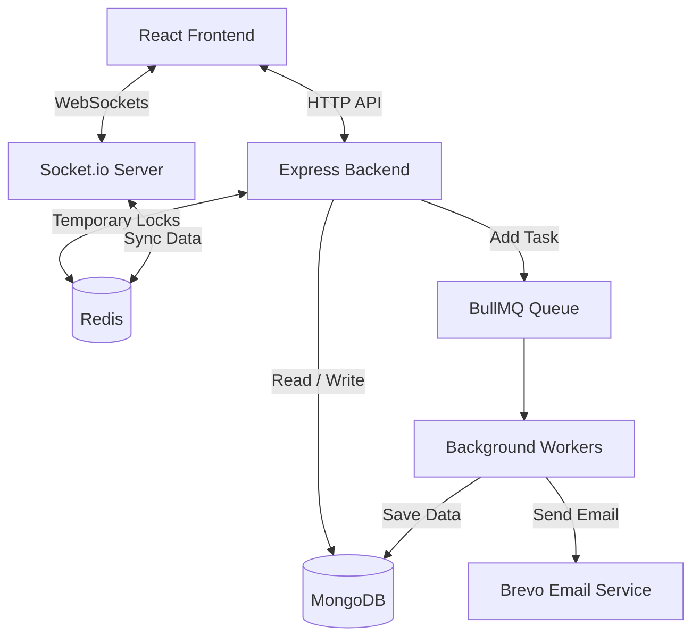

# TicketGo


> **A fast and reliable ticket booking platform built to handle sudden traffic spikes without crashing or double-booking seats.**

TicketGo is a full-stack ticketing application built to solve common problems in online ticketing, such as double-booking the same seat, database crashes during high traffic, and keeping seat availability updated in real time.

By using a flexible booking system, TicketGo changes how it books tickets based on the size of the event. It uses Redis locks for small, specific seat bookings, and fast MongoDB updates for large stadium events.

---

## Key Features

- **Smart Ticket Inventory:** 
  - *Reserved Seating:* Uses Redis locks to make sure a specific seat (like Row A, Seat 12) can only be booked by one person at a time.
  - *Large Zones:* For big events where specific seats don't matter, it uses fast MongoDB updates to let thousands of users buy tickets at the same time without slowing down.
- **Real-Time Seat Updates:** Uses `Socket.io` to instantly update the seat map for all users when someone holds or buys a ticket.
- **Background Tasks:** Uses `BullMQ` to handle heavy tasks in the background, like generating lots of seats, creating PDF tickets, and sending emails.
- **Secure Login & Roles:** Features email OTP verification, secure JWT login, and different user roles (`CUSTOMER`, `ORGANIZER`, `ADMIN`).
- **Strong Security:** Includes rate limiting to stop bots from spamming the server, input cleaning, and secure HTTP headers using Helmet.
- **Modern User Interface:** A fast and responsive React frontend styled with Tailwind CSS, featuring an interactive seat selection map.

---

## Tech Stack

### Frontend
- **Framework:** React.js (Vite)
- **Styling:** Tailwind CSS
- **Routing:** React Router DOM
- **Real-Time:** Socket.io-client

### Backend & Architecture
- **Framework:** Node.js, Express.js
- **Database:** MongoDB & Mongoose
- **Caching & Locks:** Redis (ioredis)
- **Background Jobs:** BullMQ
- **Real-Time Communication:** Socket.io 
- **Security:** JWT, bcryptjs
- **Emails:** Brevo API

---

## System Architecture

TicketGo is built to be fast and handle many users at once by breaking down tasks into smaller pieces.



### 1. Booking Specific Seats
When a user clicks on a seat, the server places a temporary 10-minute lock on it using Redis. If successful, the seat is marked as "HELD" and everyone else sees it turn gray instantly. If the user doesn't finish paying in 10 minutes, a background worker automatically unlocks the seat for others to buy.

### 2. Booking Large Zones (General Admission)
For huge events, locking individual seats is too slow. Instead, TicketGo gives the user a temporary ticket pass and simply subtracts from the total available seats in MongoDB. This allows thousands of people to check out at the exact same time without the database freezing.

---

## Local Development Setup

### What You Need
- Node.js (v18 or higher)
- MongoDB (Atlas or local)
- Redis (Upstash or local)

### Installation Steps

1. **Clone the code:**
   ```bash
   git clone https://github.com/yourusername/TicketGo.git
   cd TicketGo
   ```

2. **Start the Backend:**
   ```bash
   # Install packages
   npm install
   
   # Add your environment variables (like MONGO_URI and REDIS_URL) in a .env file
   
   # Run the server
   npm run dev
   ```

3. **Start the Frontend:**
   ```bash
   cd client
   
   # Install packages
   npm install
   
   # Run the React app
   npm run dev
   ```

---

