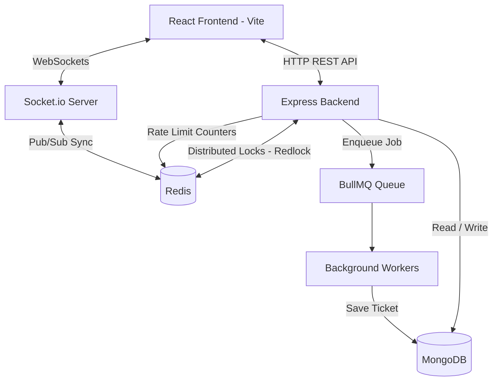

# TicketGo 🎟️

[](https://nodejs.org/)
[](https://expressjs.com/)
[](https://mongoosejs.com/)
[](https://redis.io/)
[](https://react.dev/)


**Live Website:** [https://ticketgo-live.vercel.app/](https://ticketgo-live.vercel.app/)

> **A fast and reliable ticket booking platform built to handle sudden traffic spikes without crashing or double-booking seats.**

TicketGo is a full-stack ticketing application built to solve common problems in online ticketing — such as double-booking the same seat, database crashes during high traffic, and keeping seat availability updated in real time.

By using a flexible booking system, TicketGo dynamically changes how it books tickets based on the size of the event. It uses Redis distributed locks for small, specific seat bookings, and fast atomic MongoDB updates for large stadium-scale events.

---

## Table of Contents

- [Key Features](#key-features)
- [Tech Stack](#tech-stack)
- [System Architecture](#system-architecture)
- [Prerequisites](#prerequisites)
- [Local Development Setup](#local-development-setup)
- [Environment Variables](#environment-variables)
- [Project Structure](#project-structure)
- [API Reference](#api-reference)
- [Contributing](#contributing)

---

## Key Features

- **Smart Hybrid Inventory:**
  - *Reserved Seating:* Uses Redis distributed locks (Redlock) to guarantee a specific seat (e.g., Row A, Seat 12) can only be booked by one person at a time.
  - *Zoned Capacity:* For large stadiums and festivals, drops discrete seat tracking in favor of fast atomic MongoDB `$inc` operations — allowing thousands of concurrent checkouts without the database freezing.
- **Real-Time Seat Updates:** Uses `Socket.io` WebSockets to instantly broadcast seat availability changes to all connected users when a seat is held or confirmed.
- **Background Task Processing:** Uses `BullMQ` to offload heavy operations — generating seat inventories, creating PDF tickets, and sending transactional emails — without blocking the main server.
- **Secure Authentication & Roles:** Email OTP verification, secure JWT-based login, and role-based access control (`CUSTOMER`, `ORGANIZER`, `ADMIN`).
- **Organizer Approval Workflow:** Admins can review and approve or reject organizer registrations before they can publish events.
- **Strong API Security:** Per-route rate limiting (token bucket strategy via `express-rate-limit` + Redis), HTTP security headers via `Helmet`, and password hashing with `bcryptjs`.
- **Image Uploads:** Event banner image upload via `Multer` (max 5MB, images only), stored as base64 in the database.
- **Modern Frontend:** A fast and responsive React (Vite) frontend styled with Tailwind CSS, featuring an interactive seat selection map.

---

## Tech Stack

### Frontend
| Technology | Purpose |
|---|---|
| React.js (Vite) | UI framework & fast dev server |
| Tailwind CSS | Utility-first styling |
| React Router DOM | Client-side routing |
| Socket.io-client | Real-time seat map updates |

### Backend & Infrastructure
| Technology | Purpose |
|---|---|
| Node.js + Express.js v5 | HTTP server & REST API |
| MongoDB + Mongoose | Primary database with ACID transactions |
| Redis (ioredis) | Distributed locks, caching & rate limiting |
| Redlock | Distributed mutual exclusion for seat holds |
| BullMQ | Background job queues & workers |
| Socket.io | WebSocket server for real-time events |
| JWT + bcryptjs | Authentication & password hashing |
| Helmet | Secure HTTP headers |
| express-rate-limit | Per-route bot & spam protection |
| Multer | Multipart file upload handling |
| Brevo API | Transactional email delivery (OTP, tickets) |

---

## System Architecture

TicketGo is built to handle high concurrency by separating concerns across dedicated layers.



### How Booking Works

#### 1. Reserved Seating (Specific Seats)
When a user clicks a seat, the server acquires a **Redis distributed lock** (via Redlock) on that seat for 10 minutes. If the lock succeeds, the seat is marked `HELD` in MongoDB and all other users see it go gray via Socket.io instantly. If the user abandons checkout, a BullMQ background worker automatically expires the hold and releases the seat.

#### 2. Zoned Capacity (General Admission)
For huge events, locking individual seats is too slow under load. Instead, TicketGo issues the user a **temporary zone pass** and atomically decrements the available count in MongoDB using `$inc`. This allows thousands of people to check out simultaneously without any database contention.

---

## Prerequisites

Make sure you have the following installed and available before running the project:

- **Node.js** v18 or higher — [Download](https://nodejs.org/)
- **MongoDB** — [MongoDB Atlas (free)](https://www.mongodb.com/cloud/atlas) or a local instance
- **Redis** — [Upstash (free, recommended for Windows)](https://console.upstash.com) or a local Redis instance
- **Brevo Account** — [Sign up free](https://app.brevo.com) for transactional email (OTP + tickets)

---

## Local Development Setup

### 1. Clone the repository

```bash
git clone https://github.com/VedDonda/TicketGo.git
cd TicketGo
```

### 2. Set up the Backend

```bash
# Install backend dependencies
npm install

# Copy the example env file and fill in your values
cp .env.example .env

# Start the backend in development mode (auto-restarts on file changes)
npm run dev
```

> The backend server will start on `http://localhost:5000` by default.

### 3. Set up the Frontend

```bash
cd client

# Install frontend dependencies
npm install

# Start the React development server
npm run dev
```

> The frontend will start on `http://localhost:5173` by default.

---

## Environment Variables

Copy `.env.example` to `.env` and fill in your own values. **Never commit your `.env` file.**

```bash
cp .env.example .env
```

| Variable | Required | Description |
|---|---|---|
| `PORT` | No | Port for the backend server (default: `5000`) |
| `MONGO_URI` | ✅ Yes | MongoDB connection string (Atlas or local) |
| `JWT_SECRET` | ✅ Yes | A long, random secret string for signing JWT tokens |
| `JWT_EXPIRES_IN` | No | JWT expiry duration (default: `7d`) |
| `NODE_ENV` | No | `development` or `production` |
| `REDIS_URL` | ✅ Yes | Full Upstash Redis URL (recommended) |
| `REDIS_HOST` | No | Local Redis host (only if not using `REDIS_URL`) |
| `REDIS_PORT` | No | Local Redis port (only if not using `REDIS_URL`) |
| `BREVO_API_KEY` | ✅ Yes | API key from Brevo → SMTP & API → API Keys |
| `BREVO_SENDER_EMAIL` | ✅ Yes | A verified sender email in your Brevo account |
| `BREVO_SENDER_NAME` | No | Display name for outgoing emails (default: `TicketGo`) |

---

## Project Structure

```
TicketGo/
├── client/                  # React + Vite frontend
│   └── src/
├── src/                     # Backend source
│   ├── config/              # MongoDB & Redis connection setup
│   ├── controllers/         # Route handler logic
│   │   ├── authController.js
│   │   ├── bookingController.js
│   │   ├── eventController.js
│   │   ├── userController.js
│   │   └── adminController.js
│   ├── middleware/           # Auth guards & rate limiters
│   │   ├── authMiddleware.js
│   │   └── rateLimiter.js
│   ├── models/              # Mongoose schemas
│   │   ├── User.js
│   │   ├── Event.js
│   │   ├── Ticket.js
│   │   ├── Inventory.js
│   │   ├── BookedZone.js
│   │   └── ZonedHold.js
│   ├── queues/              # BullMQ queue definitions
│   ├── routes/              # Express route definitions
│   │   ├── authRoutes.js
│   │   ├── eventRoutes.js
│   │   ├── userRoutes.js
│   │   ├── adminRoutes.js
│   │   └── uploadRoutes.js
│   ├── utils/               # Shared helper functions
│   └── workers/             # BullMQ background job processors
├── app.js                   # Express app configuration
├── server.js                # Server entry point (HTTP + Socket.io)
├── .env.example             # Environment variable template
└── package.json
```

---

## API Reference

All API routes are prefixed with `/api`. Protected routes require a `Bearer <token>` JWT in the `Authorization` header.

### 🔐 Auth — `/api/auth`

| Method | Endpoint | Auth | Description |
|---|---|---|---|
| `POST` | `/signup` | — | Register a new user account |
| `POST` | `/verify-otp` | — | Verify email with OTP code |
| `POST` | `/resend-otp` | — | Resend the OTP verification email |
| `POST` | `/login` | — | Login and receive a JWT |
| `POST` | `/forgot-password` | — | Request a password reset OTP |
| `POST` | `/reset-password` | — | Reset password using OTP |
| `GET` | `/me` | ✅ JWT | Get the currently logged-in user |

### 🎫 Events & Booking — `/api/events`

| Method | Endpoint | Auth | Description |
|---|---|---|---|
| `GET` | `/` | — | Get all published events |
| `GET` | `/:id` | Optional | Get a single event by ID |
| `GET` | `/:id/image` | — | Get the event banner image |
| `POST` | `/` | ORGANIZER | Create a new event |
| `PUT` | `/:id/image` | ORGANIZER | Update an event's banner image |
| `PUT` | `/:id/publish` | ORGANIZER | Publish a draft event |
| `DELETE` | `/:id` | ADMIN | Delete an event |
| `GET` | `/organizer/me` | ORGANIZER | Get all events created by me |
| `GET` | `/:id/dashboard-metrics` | ORGANIZER | Get sales & attendance metrics |
| `GET` | `/:id/seats` | ✅ JWT | Get the full seat map for an event |
| `GET` | `/:id/zones` | ✅ JWT | Get zone inventory for a large event |
| `POST` | `/:id/hold` | ✅ JWT | Place a temporary hold on seat(s) |
| `POST` | `/:id/release` | ✅ JWT | Release a held seat before purchase |
| `POST` | `/:id/confirm` | ✅ JWT | Confirm purchase and issue ticket(s) |
| `GET` | `/:id/my-tickets` | ✅ JWT | Get my tickets for a specific event |

### 👤 User Profile — `/api/users`

| Method | Endpoint | Auth | Description |
|---|---|---|---|
| `GET` | `/me/profile` | ✅ JWT | Get my profile |
| `PUT` | `/me/profile` | ✅ JWT | Update my profile |
| `PUT` | `/me/password` | ✅ JWT | Change my password |
| `GET` | `/me/bookings` | ✅ JWT | Get all my bookings |

### 🛡️ Admin — `/api/admin`

| Method | Endpoint | Auth | Description |
|---|---|---|---|
| `GET` | `/organizers/pending` | ADMIN | List organizers awaiting approval |
| `PUT` | `/organizers/:id/approve` | ADMIN | Approve an organizer account |
| `DELETE` | `/organizers/:id/reject` | ADMIN | Reject an organizer account |

### 📁 Uploads — `/api/upload`

| Method | Endpoint | Auth | Description |
|---|---|---|---|
| `POST` | `/` | ✅ JWT | Upload an image file (max 5MB) |

---

## Contributing

Contributions are welcome! Here's how to get started:

1. **Fork** the repository
2. **Create** a feature branch: `git checkout -b feature/your-feature-name`
3. **Commit** your changes: `git commit -m "feat: add your feature"`
4. **Push** to your branch: `git push origin feature/your-feature-name`
5. **Open a Pull Request** against the `main` branch

Please make sure your code follows the existing style and doesn't break any existing routes before submitting a PR.

---